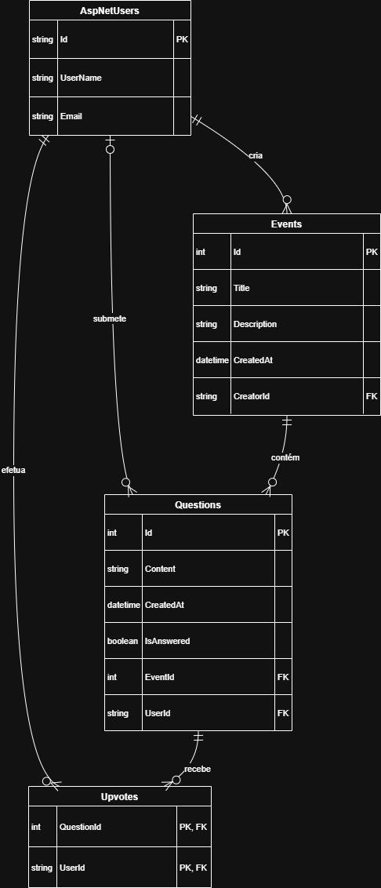

# LiveQ-Platform
LiveQ é uma plataforma de perguntas e respostas em tempo real (real-time), construída com ASP.NET Core Razor Pages e SignalR. Projeto académico para a disciplina de Desenvolvimento Web da Licenciatura de Engenharia Informática e desenvolvido pelos alunos Miguel Santos e João Sousa.

## Diagrama da Base de Dados

